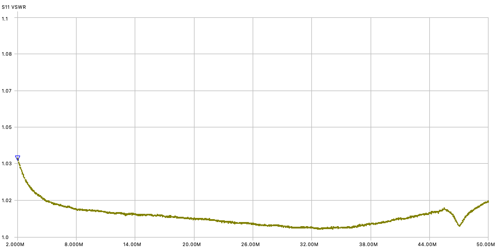
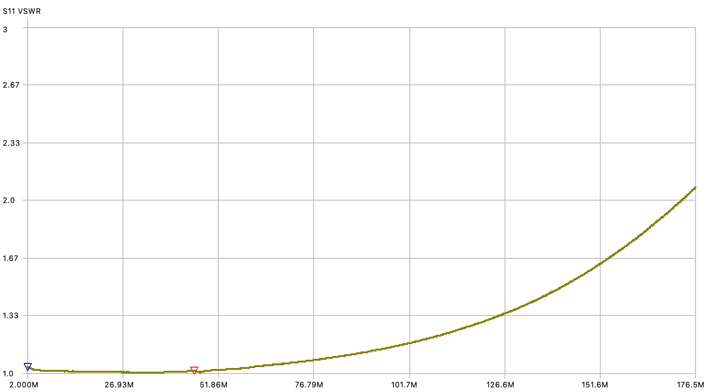
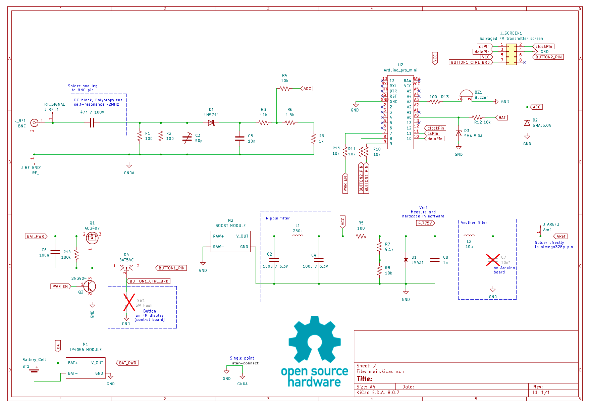
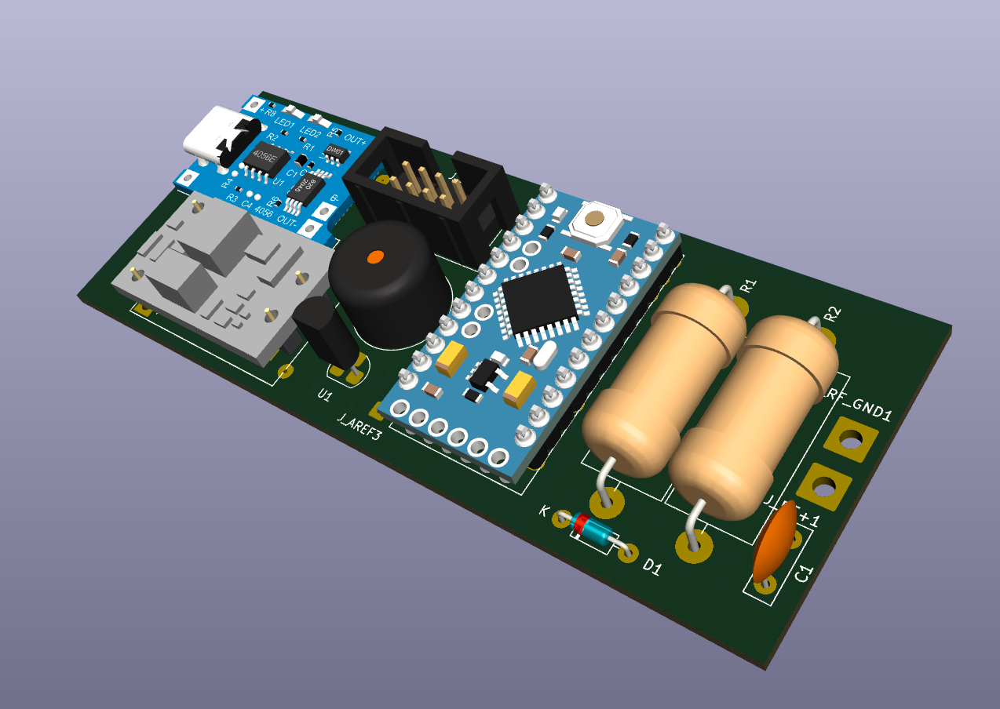
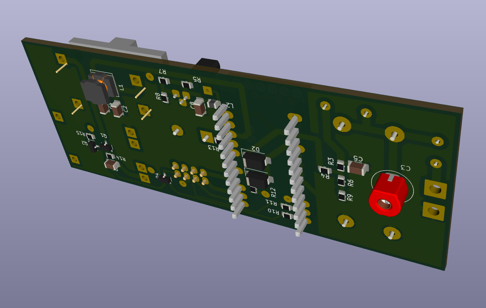
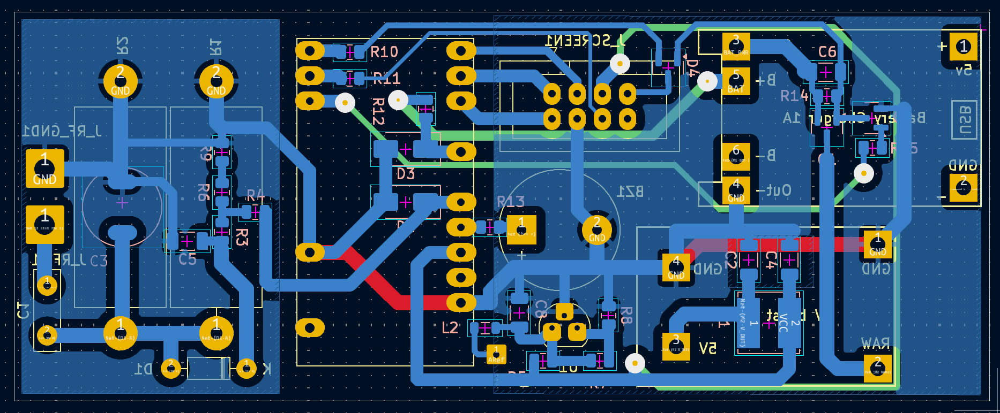
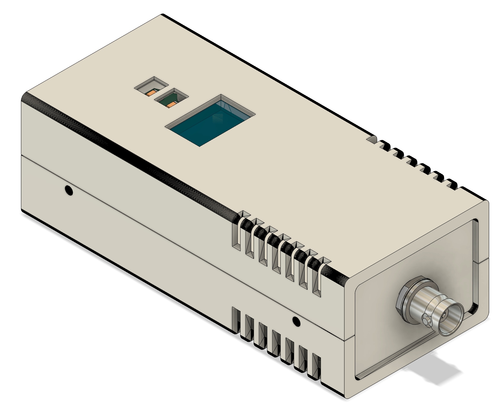

# RF Power Meter QRP

A microcontroller-based 6W RF power meter designed for Ham QRP.

## Features

- Up to 6W RF power meter, assumes sin wave
- Peak power hold mode
- Compensated frequency resonse, less that 1.03 SWR 2-50MHz
- Power measurements in dBm and Watts on 4-digit LED display
- Support for multiple Ham frequency bands (3.7-50MHz)
- Calibrated and uses polynomial curve fitting for accurate measurements. Manually set frequency band in settings.
- Battery voltage monitoring and auto power-off after 5 minutes of inactivity. Press any button to reset.
- Vent holes on plastic enclosure have filters made of surgical mask fiber (anti dust for field operation)

## 2MHz - 50MHz

## 2MHz - 175MHz

## Hardware

Schematic - [PDF](schematic.pdf)

- Arduino-compatible microcontroller
- 4-digit+MHz symbol LED display (salavged from a car FM transmitter)
- RF didode detector circuit
- Power latch circuit for MCU driven turn off
- Buzzer for audio feedback
- External precision voltage reference 

## Usage

- **To Power On**: Flip the main (storage mode) switch to ON. Press and hold the OK button (lower) to power on. Device starts with battery voltage displayed, followed by the currently selected frequency band. 

- **Info Button** (top):
  - Single click: Toggle between dBm/Watts
  - Double click: Enter measurement mode selection. Use the same button to switch between modes **continious** (default) vs **hold peak** mode. Use OK button to confirm when done.
  - Long press: Enter frequency band selection. Use the same button to cycle through bands.Use OK button to confirm when done.
- **OK Button** (bottom):
  - Single click: When in main screen - resets to zero, in menu screens confirms selection and exit to the main screen.
  - Long press (2s): Powers off

## Technical Specifications

- Calibrated for Ham frequency bands: 3.7MHz, 7.2MHz, 14.2MHz, 18MHz, 21MHz, 24MHz, 28MHz, 50MHz 
- Min power level: 2mW (3dBm)
- Max power level: 6.3W (38dBm) in short burst, 4W continious
- Not temperature compensated
- Internal 500mAh battery, USB charged
- When powered off, 200uA current consumption. Use storage mode switch to disconnect internal battery.

## License

[MIT License](LICENSE)