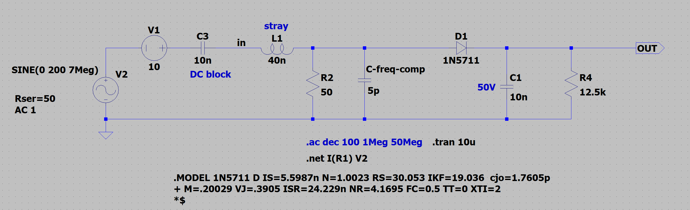
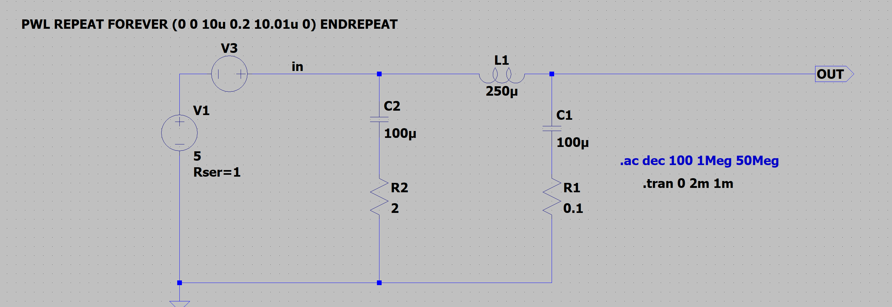

# RF Power Meter QRP

This microcontroller-based RF power meter is tailored for Ham QRP, capable of measuring up to 6W. It offers power readings in two formats:

1. Milliwatts (mW) – displayed as a 4-digit value without decimals.
1. Decibel-milliwatts (dBm) – shown with one decimal place. Since the display lacks a dot, the reading appears as a 3-digit number (e.g., "123" represents 12.3 dBm).
1. Accuracy 0.4% @ 6W (+-25mW), 5% @ 10mW (+-0.5mW)

## Features

- Up to 6W RF power meter, assumes sin wave
- Peak power hold mode
- Compensated frequency resonse, less that 1.03 SWR 2-50MHz
- Power measurements in dBm and Watts on 4-digit LED display
- Support for multiple Ham frequency bands (3.7-50MHz)
- Calibrated and uses polynomial curve fitting for accurate measurements. Manually set frequency band in settings.
- Battery voltage monitoring and auto power-off after 5 minutes of inactivity. Press any button to reset.
- Vent holes on plastic enclosure have filters made of surgical mask fiber (anti dust for field operation)

## 2MHz - 50MHz


## 2MHz - 175MHz


## Hardware

Schematic - [PDF](schematic.pdf)


- Arduino-compatible microcontroller
- 4-digit+MHz symbol LED display (salavged from a car FM transmitter)
- RF didode detector circuit
- Power latch circuit for MCU driven turn off
- Buzzer for audio feedback
- External precision voltage reference 


## Usage

- **To Power On**: Flip the main (storage mode) switch to ON. Press and hold the OK button (lower) to power on. Device starts with battery voltage displayed, followed by the currently selected frequency band. 

- **Info Button** (top):
  - Single click: Toggle between dBm/Watts
  - Double click: Enter measurement mode selection. Use the same button to switch between modes **continious** (default) vs **hold peak** mode. Use OK button to confirm when done.
  - Long press: Enter frequency band selection. Use the same button to cycle through bands.Use OK button to confirm when done.
- **OK Button** (bottom):
  - Single click: When in main screen - resets to zero, in menu screens confirms selection and exit to the main screen.
  - Long press (2s): Powers off

## Technical Specifications

- Calibrated for Ham frequency bands: 3.7MHz, 7.2MHz, 14.2MHz, 18MHz, 21MHz, 24MHz, 28MHz, 50MHz 
- Accuracy 0.4% @ 6W (+-25mW), 5% @ 10mW (+-0.5mW)
- Min power level: 2mW (3dBm)
- Max power level: 6.3W (38dBm) in short burst, 4W continious
- Not temperature compensated
- Internal 500mAh battery, USB charged
- When powered off, 200uA current consumption. You can use storage mode switch to disconnect internal battery competely.


## Notes

Since it's a diode detector the only thing it can measure is peak voltage. Code inside assumes that input RF signal is a pure sine wave to make RF power calculations. 

### Frequency compensation

Leads and connector and other stray inductance skew 50Ω impedance, one good way to compensate is to add adjustanble shunt capacitance. Use VNA to adjust after pcb assembly.


[ltspice file](ltspice/qrt-rf-power-meter-shunt-cap-compensation.asc)

### DC supply filtering

Internal battery is nominal 3.7V, but the salvaged LCD screen needs 5V. There is boost DC-DC converter that gives 200mV ripple. There are two filters - one right after the converter, this goes to MCU. There is another one just before reference voltage goes to Aref pin.


[ltspice file](ltspice/power-ripple-filter.asc)

### Interface

The Salvaged FM LCD screen has two buttons, so I had to fallback to "click" vs "double-click" vs "long click" technique. The same button function differently depending in which mode device currently is - "main screen" vs "settings"

The screen itself has 4 digits and one dot. The dot is connected to "MHz" symbol. They always lit together.
Although I needed the dot for measurements, for example for dBms, I decided that showing "12.3 MHz" and claiming that this is "12.3 dBm" is rather akward. So the reading appears as a 3-digit number e.g. "123" represents 12.3 dBm. Watts reading always appear as 4 digit numbers with leading zeros as mW, "0123" reading represents 123mW. The dot and the "MHz" symbol come very handy when displaying frequency band. This setting is used to select which callibration curve to apply to the actual measurement.

Here is transition diagram.

```
                 ┌─────────────────┐    OK button       ┌─────────────┐
                 │  Cycle through  ├────────────────────►  Saves to   │
                 │    Ham bands    │      click         │    NVRAM    │
                 └─────────────────┘                    └───────┬─────┘
                           ▲                                    │      
             info button   │                                    │      
               click       │                                    │      
                 ┌─────────┴───────────┐                        │      
                 │                     │                        │      
                 │   Frequency band    │                        │      
        ┌───────►│     selection       │◄─────┐                 │      
        │        │      screen         │      │                 │      
        │        │                     │      │                 │      
info button      └─────────────────────┘   info button          │      
long press                                 long press           │      
        │                                     │                 │      
        │                                     │                 │      
        │                                     │                 │      
        │                                     │                 │      
        │                                     │                 │      
   ┌────┴──────────┐              ┌───────────┴───┐             │      
   │               │  info button │               │             │      
   │  Main screen  ├─────────────►│  Main screen  │◄────────────┘      
   │    mWatts     │◄─────────────┤     dBm       │                    
   │               │   click      │               │                    
   └──────────┬────┘              └──────┬────▲───┘                    
              │                          │    │                        
      info button                info button  │                        
      double click               double click │     When in the        
              │                          │    │    "Hold Peak mode"    
              │                          │    │     display blinks     
              │    ┌──────────────┐      │    │                        
              │    │  Continious  │      │    │                        
              └────►     vs       ◄──────┘    │OK button               
                   │  Hold peak   │           │ click                  
                   └───────┬──────┘           │                        
                           │                  │                        
                      info button             │                        
                        click                 │                        
                           │                  │                        
                   ┌───────▼─────────┐        │                        
                   │  Cycle through  ├────────┘                        
                   │    two modes    │                                 
                   └─────────────────┘                                 
```                   

In any mode, long press on the "OK" button turns power off.

## License

[MIT License](LICENSE)